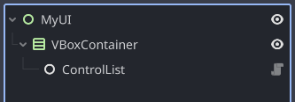

# Control List for Godot

A small Godot addon that renders a dynamic list of items as UI Controls.

- Drop a ControlList node under any Control container.
- Give it an array of items.
- It will insert, delete, and move child Controls to match your data efficiently
  using [the Myers diffing algorithm](https://www.nathaniel.ai/myers-diff/).
- Existing Controls are reused when possible, so your per-item state stays intact.

Useful for inventories, chat/message feeds, settings lists, leaderboards, etc.

This is similar to Qt's ListView and Android's RecyclerView+DiffUtil. 

## Features

- Reuses existing nodes when items are the “same” (you decide what “same” means)
- Can be placed in any container that handles multiple items (HFlowContainer, VBoxContainer…)
- Can exist alongside other Controls in the same container, such as headers and footers 
- Simple factory API - return any Control you like (Label, HBoxContainer, custom scene…)
- Deferred updates by default to prevent redundant updates, with an option to update immediately

## Install

There are two options:

1. ~From the Asset Library~

   Soon! Waiting for their approval.

3. From a release
    - Download the control-list.zip from the GitHub Releases of this repo.
    - Unzip into your project so it lands at: addons/control-list

## Quick start

1. Add a ControlList node as a child under any Control container that should hold your items (e.g. a VBoxContainer).
2. Provide a factory function to build a Control for each item: `set_control_factory`
3. (Recommended) Provide a key function that returns a stable identity for each item: `set_item_key`
4. Call `update_list(new_items)` whenever your data changes.

Example:



```gdscript
@onready var cl: ControlList = $VBoxContainer/ControlList

func _ready():
	# Create a simple Label for each item
	cl.set_control_factory(
		func(item):
			var label := Label.new()
			label.text = item.name
			return label
	)
	
	# Use a stable key so items are reused/moved
	cl.set_item_key(func(item): return item.id)
	
	# Render items
	cl.update_list([
		{ "id": "item_sword", "name": "Sword" },
		{ "id": "item_shield", "name": "Shield" },
		{ "id": "item_helmet", "name": "Helmet" },
	])


# Later… update with new content
cl.update_list([
	{ "id": "item_shield", "name": "Shield" },	# moved
	{ "id": "item_bow", "name": "Bow" },      	# inserted
	{ "id": "item_helmet", "name": "Helmet" },	# moved
])
```

## Sample project

See the sample/ directory for a small example of a shop UI.
ControlList is set up in [sample_shop.gd](./sample/sample_shop.gd).

## How it works

ControlList looks at the previous item array vs the new one.
It runs a Myers diff and computes insert/delete/move operations.
It applies those operations to child Controls under the ControlList’s parent.
If keys match, nodes are reused and only moved. If a key disappears, the node is freed.

## Important notes

- Parent must be a Control. Add ControlList as a child under the container that should hold your list items.
- Items are added as siblings next to the ControlList (children of its parent),
  ordered immediately after the ControlList.
- Your factory should create fresh Controls for inserts. Visual updates for existing items are up to you.

## Testing

This repo includes GdUnit4 tests.

- You’ll need Godot 4.4 installed. Tests currently fail on 4.5,
  but it seems to be an issue with the test runner, not this library.
- Set the environment variable GODOT_BINARY to your Godot executable.
- Run: `./run_all_tests.sh`

Example on macOS:

```bash
export GODOT_BINARY=/Applications/Godot.app/Contents/MacOS/Godot
./run_all_tests.sh
```

## Compatibility

- Tested on Godot 4.5 and 4.4.

## Future plans

- Maybe: Content change notifications
  - Given a function that determines whether two items have equal data,
    notify that that item should be updated.
    I'm used to this pattern from mobile UI development, but not sure
    if it makes as much sense in Godot.
- Maybe: Make position known to items
- Maybe: Background thread diffing
